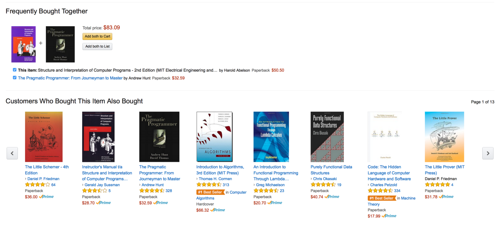

# Deep Scalable Recommender Systems AWS
Our goal is to prototype deep scalable recommender systems on AWS.

## What are recommender systems?
Most of us have experienced the power of personalized recommendations firsthand. Maybe you found former colleagues and classmates with LinkedIn’s “People You May Know” feature. Perhaps you watched a movie because Netflix suggested it to you. And you’ve most likely bought something that Amazon recommended under “Frequently Bought Together” or “Customers Who Bought This”. Simply put it is a mechanism to recommend items or services to the customer based on their interests or of their look-a-likes to offer personalization. Below is an example of how product reccomendations look like in Amazon.

## Why are recommender system important?

The age of search has come to an end. 

- Chirs Anderson in “The Long Tail”:
We are leaving the age of information and entering the age of 	recommendation

- CNN Money, “The race to create a ‘smart’ Google”
The Web, they say, is leaving the era of search and entering one of discovery. 	What's the difference? Search is what you do when you're looking for 	something. Discovery is when something wonderful that you didn't know existed, 	or didn't know how to ask for, finds you.

Recommendation engines account for a huge share of revenue and user activity, often 30 to 50 percent, for instance 35 percent of what consumers purchase on Amazon and 75 percent of what they watch on Netflix come from product recommendations based on highly personalized marketing of which recommender systems play a large part.

## Business Value
## Preprocessing Pipeline
## Two ways of implementation 

1. Sagemaker
2. DSSTNE

## Conclusion

## References
1. https://www.mckinsey.com/industries/retail/our-insights/how-retailers-can-keep-up-with-consumers
2. https://medium.com/ai-society/a-concise-recommender-systems-tutorial-fa40d5a9c0fa
